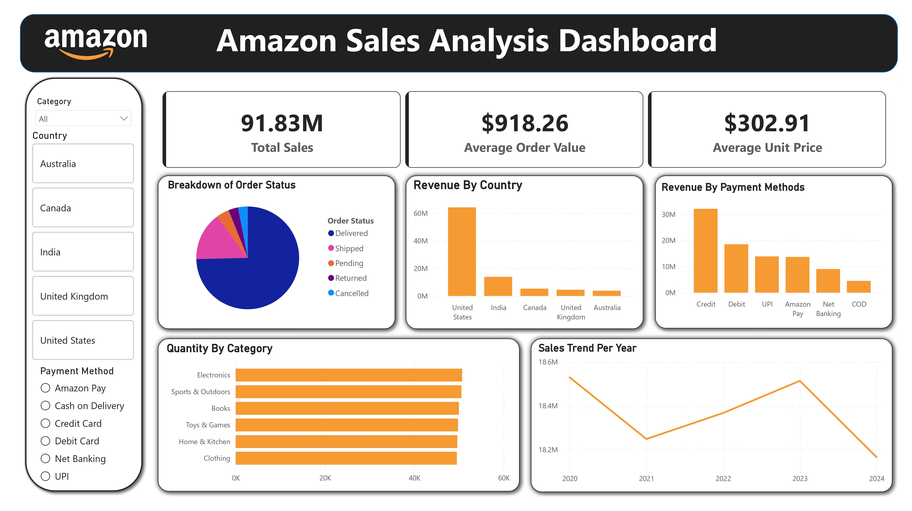

# Amazon Sales Analysis

This project analyzes Amazon sales transaction data to uncover patterns in customer purchasing behavior, product performance, revenue generation, and operational business performance. The analysis combines Python, MySQL, and Power BI to transform raw e-commerce transactional data into meaningful insights and actionable business recommendations.

The goal was to simulate a real-world e-commerce data analytics workflow, starting from raw data preparation and ending with dashboard reporting and business intelligence analysis.

## Project Objective

The purpose of this project was to understand sales performance and answer practical business questions such as:

- Which product categories generate the most revenue?
- Which products contribute the highest sales?
- Which customers spend the most?
- What are the monthly revenue trends over time?
- Which payment methods generate the highest revenue?
- Which cities contribute the most to total sales?
- What is the cancellation rate across categories?
- Which brands perform best?
- Which products have the highest sales volume?

## Tools and Technologies

- Python
- Pandas
- MySQL
- Power BI
- Jupyter Notebook

## Project Workflow

The project was completed in the following stages:

1. Data cleaning and preprocessing
2. Exploratory data analysis
3. Data quality validation
4. SQL-based business analysis
5. Dashboard development in Power BI
6. Business insight generation

## Dataset Overview

The dataset contains approximately 100,000 Amazon sales transaction records, including:

- Order information
- Customer details
- Product information
- Category and brand details
- Quantity and pricing
- Discounts and taxes
- Shipping costs
- Payment methods
- Order status
- Geographic sales data
- Seller information

## Data Preparation

The raw dataset was cleaned and prepared using Python.

Key preprocessing steps included:

- Conducting comprehensive null value checks
- Standardizing column names
- Validating data consistency
- Verifying data types
- Converting the dataset into an analysis-ready format

## Exploratory Data Analysis

Exploratory analysis was performed to identify trends and patterns across sales performance.

Areas analyzed:

- Revenue distribution
- Product performance
- Customer purchase behavior
- Payment method trends
- Geographic sales performance
- Cancellation patterns
- Brand performance
- Sales trends over time

## SQL Business Analysis

After preprocessing, the dataset was imported into MySQL for deeper business analysis.

Some business questions explored:

- Revenue generated by product categories
- Top revenue-generating products
- Highest spending customers
- Monthly revenue trends
- Payment method revenue comparison
- Revenue contribution by city
- Cancellation rate analysis
- Brand revenue comparison
- Average order value by category
- Product demand analysis

SQL concepts used:

- Aggregations
- Conditional aggregation
- Date functions
- Group By operations
- Sorting and ranking
- LIMIT clause
- Boolean conditions
- CASE statements

## Key Insights

Some notable findings from the analysis:

- Electronics emerged as the highest revenue-generating category
- Credit Card generated the highest total revenue among payment methods
- Charlotte was the highest revenue-contributing city
- CoreTech was the top-performing brand by revenue
- Clothing showed the highest average order value
- LED Desk Lamp was among the highest-selling products by quantity
- Electronics showed comparatively higher cancellation rates
- Revenue trends showed consistent business activity over time

## Dashboard

An interactive Power BI dashboard was built to visualize sales performance and business insights.

Dashboard includes:

- Revenue KPIs
- Order analysis
- Product performance insights
- Category-wise sales analysis
- Payment method comparison
- Geographic revenue analysis
- Brand performance metrics
- Cancellation tracking
- Monthly sales trends
- Interactive filters and slicers

## Business Recommendations

Based on the analysis:

- Focus inventory planning for high-demand products
- Strengthen partnerships with top-performing brands
- Optimize payment-based promotional campaigns
- Investigate cancellation causes in high-risk categories
- Increase focus on high-performing geographic markets
- Improve retention strategies for high-value customers

## Future Improvements

Possible extensions for this project:

- Sales forecasting
- Customer lifetime value analysis
- Product recommendation system
- Seller performance analytics
- Profit margin analysis
- Real-time dashboard deployment
- Web application integration

## Skills Demonstrated

This project helped demonstrate practical skills in:

- Data Cleaning
- Exploratory Data Analysis
- SQL Querying
- Business Analytics
- KPI Analysis
- Data Visualization
- Dashboard Development
- Sales Performance Analysis
- Data Storytelling
